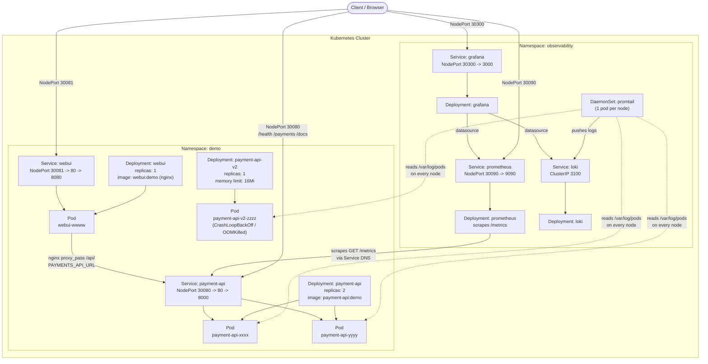

# Kubernetes Architecture

Diagram of how `payment-api`, its `webui` frontend and the observability
stack are laid out in the cluster. Manifests live under [`k8s/`](../k8s/).

## Overview

## Components

### `demo` namespace ([k8s/deployment-healthy.yaml](../k8s/deployment-healthy.yaml), [k8s/deployment-broken.yaml](../k8s/deployment-broken.yaml), [k8s/service.yaml](../k8s/service.yaml), [k8s/webui-deployment.yaml](../k8s/webui-deployment.yaml))

- **`payment-api` Deployment**: 2 replicas of the FastAPI app, exposing
  `/health`, `/payments` and `/metrics` on container port `8000`. Liveness and
  readiness probes hit `/health`.
- **`payment-api` Service**: `NodePort`, forwards port `80` to the pods'
  `8000`, exposed on the node at `30080`.
- **`payment-api-v2` Deployment**: intentionally broken variant (16Mi memory
  limit) used for the CrashLoopBackOff/OOMKilled troubleshooting demo. Not
  wired to any Service — it's inspected directly with `kubectl describe` /
  `kubectl logs`.
- **`webui` Deployment**: 1 replica of the Angular app built and served by
  nginx on container port `8080`. nginx serves the static build and reverse
  proxies `/api/` to `PAYMENTS_API_URL` (defaults to
  `payment-api.demo.svc.cluster.local`), so the browser only ever talks to
  `webui` — no CORS, no direct backend exposure.
- **`webui` Service**: `NodePort`, forwards port `80` to the pods' `8080`,
  exposed on the node at `30081`.

### `observability` namespace ([k8s/observability/](../k8s/observability/))

- **Prometheus**: scrapes `payment-api.demo.svc.cluster.local:80/metrics`
  plus any pod annotated `prometheus.io/scrape: "true"`. Exposed via
  NodePort `30090`.
- **Loki**: log storage backend, `ClusterIP` only (internal, port `3100`).
- **Promtail**: `DaemonSet`, one pod per node, tails `/var/log/pods` on the
  host and pushes log lines to Loki.
- **Grafana**: pre-provisioned with Prometheus and Loki as datasources.
  Exposed via NodePort `30300`, anonymous viewer access enabled for demos.

## Access summary

| Component  | Namespace     | Type     | Port(s)         |
|------------|---------------|----------|------------------|
| webui      | demo          | NodePort | 30081 -> 80 -> 8080 |
| payment-api| demo          | NodePort | 30080 -> 80 -> 8000 |
| prometheus | observability | NodePort | 30090 -> 9090    |
| grafana    | observability | NodePort | 30300 -> 3000    |
| loki       | observability | ClusterIP| 3100 (internal)  |
| promtail   | observability | DaemonSet| n/a (no Service) |

See [kodekloud-deployment.md](kodekloud-deployment.md) for how to deploy this
and [kodekloud-observability-access.md](kodekloud-observability-access.md) for
how to reach the Grafana/Prometheus UIs.
