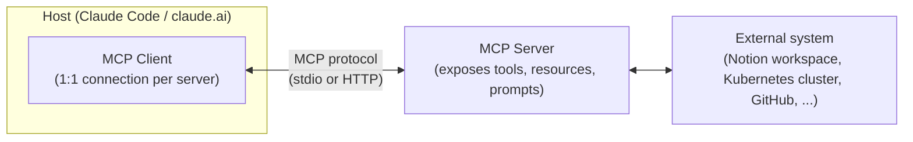

# Notion MCP Connector

Notes on how the Notion integration used to populate the workspace's "About"
page and task board (see the Notion page linked from the project's talk
prep) is connected. This is **not** a server configured for this repo — it's
a personal, account-level connector. This doc explains the distinction and
the general MCP concepts (Host / Client / Server) behind it.

## MCP roles: Host, Client, Server

The Model Context Protocol defines three roles:

- **Host**: the application the user actually talks to — here, Claude Code
  (or claude.ai). It owns the conversation and decides which servers are
  available for a given session.
- **Client**: a component inside the host that maintains one connection to
  one server, and translates the host's tool calls into MCP protocol
  messages. Each connected server gets its own client instance.
- **Server**: the program that exposes tools/resources for a specific
  system — a local process (stdio, e.g. `kubernetes-mcp-server` pointed at a
  kubeconfig) or a remote, hosted endpoint (HTTP/SSE, e.g. Notion's own MCP
  server). The server is the thing that actually knows how to talk to
  Notion's API, Kubernetes' API, etc.

## How the Notion connector is set up here

Notion's server is **remote and account-scoped**: it's authorized once
through the host's connector settings (in claude.ai: *Settings →
Connectors*), using OAuth against a specific Notion workspace. Once
authorized, the connection is tied to the user's account, not to a
particular repository, machine, or config file checked into a project.

That means:

- There is no `.mcp.json` entry or local config file in this repository for
  it, and there shouldn't be — the authorization isn't something a file in
  this repo could express or reproduce for another user.
- The same connector is available in *any* Claude Code / claude.ai session
  under that account, regardless of which project is open.
- Nothing about it can leak into this repo's git history, because nothing
  about it is stored here.

This is a different setup from the **GitHub** and **Kubernetes** MCP
servers this repo's demos use (see [README.md](../README.md)): those are
connected per-project (`claude mcp add ...` / `/mcp`), and are candidates
for a committed, project-scoped `.mcp.json` (with credentials referenced via
environment variables, never inlined) precisely because every collaborator
running the demo needs the same servers. Notion doesn't fit that pattern —
it's a personal workspace connection, not project infrastructure.

## What the Notion connector can do

Once connected, the host exposes a set of tools backed by Notion's MCP
server (search, fetch, create/update pages, create databases, comments,
attachments, and so on). They operate on whatever pages and databases the
authorizing user's Notion account has access to — the connector doesn't
grant the assistant any access beyond what that account already has.

## Revoking access

Access can be revoked at any time from the host's connector settings
(claude.ai → *Settings → Connectors* → disconnect Notion). Revoking there
immediately invalidates the connection; there is no local file or repo
change needed on this end.
